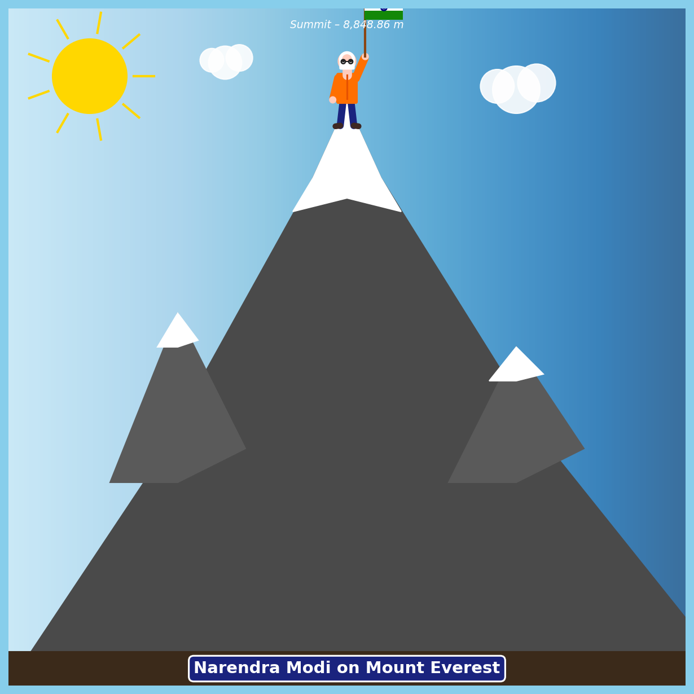

# Ajay

## Modi on Mount Everest – Image Download Guide

This repository contains a Python script (`modi_on_everest.py`) that generates
an artistic illustration of Narendra Modi standing on the summit of Mount Everest,
and the pre-generated image (`modi_on_everest.png`).

Follow **any one** of the methods below to download the image.

---

## Method 1 – Download directly from GitHub (no coding required)

1. Open your web browser and go to the repository page:  
   `https://github.com/ajaynandal24-eng/Ajay`

2. In the file list, click on **`modi_on_everest.png`**.

3. The image preview will open. Click the **Download** button  
   (⬇ icon in the top-right toolbar, or right-click the image → **Save image as…**).

4. Choose a folder on your computer and click **Save**.  
   The file `modi_on_everest.png` is now saved locally. ✅

---

## Method 2 – Download with `curl` (command line)

Open a terminal and run:

```bash
curl -L -o modi_on_everest.png \
  "https://raw.githubusercontent.com/ajaynandal24-eng/Ajay/copilot/create-image-of-modi-everest/modi_on_everest.png"
```

The image will be saved as `modi_on_everest.png` in the current directory.

---

## Method 3 – Download with `wget` (command line)

```bash
wget -O modi_on_everest.png \
  "https://raw.githubusercontent.com/ajaynandal24-eng/Ajay/copilot/create-image-of-modi-everest/modi_on_everest.png"
```

---

## Method 4 – Clone the entire repository

If you also want the Python source code, clone the whole repo:

```bash
# 1. Install Git if you don't have it: https://git-scm.com/downloads

# 2. Clone the repository
git clone https://github.com/ajaynandal24-eng/Ajay.git

# 3. Enter the folder
cd Ajay

# 4. The image is already here
ls modi_on_everest.png
```

---

## Method 5 – Generate the image yourself with Python

If you prefer to generate a fresh copy of the image:

```bash
# 1. Make sure Python 3 is installed: https://www.python.org/downloads/

# 2. Install the only required library
pip install matplotlib

# 3. Run the script
python modi_on_everest.py

# 4. The image is saved as modi_on_everest.png in the same folder
```

---

## Preview


